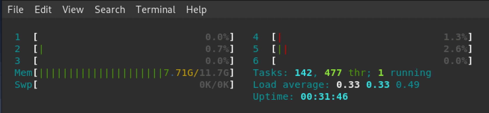
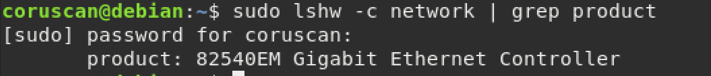
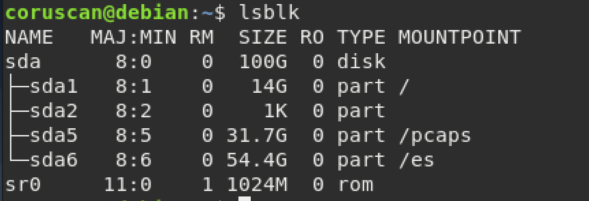
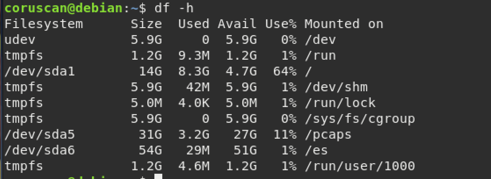
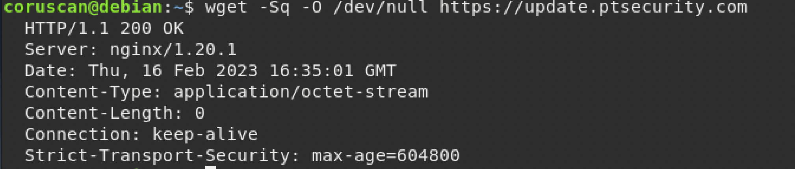
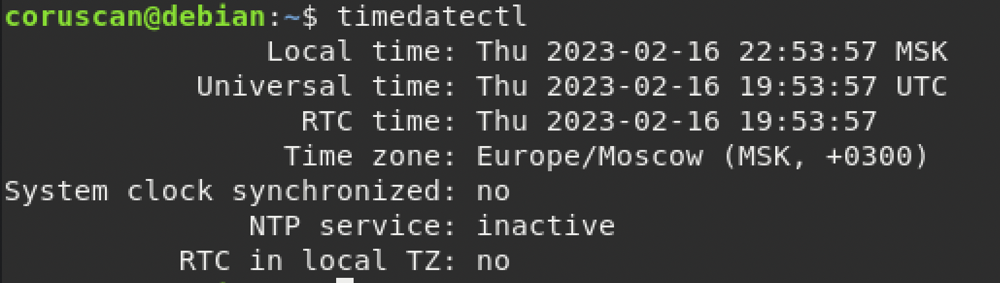
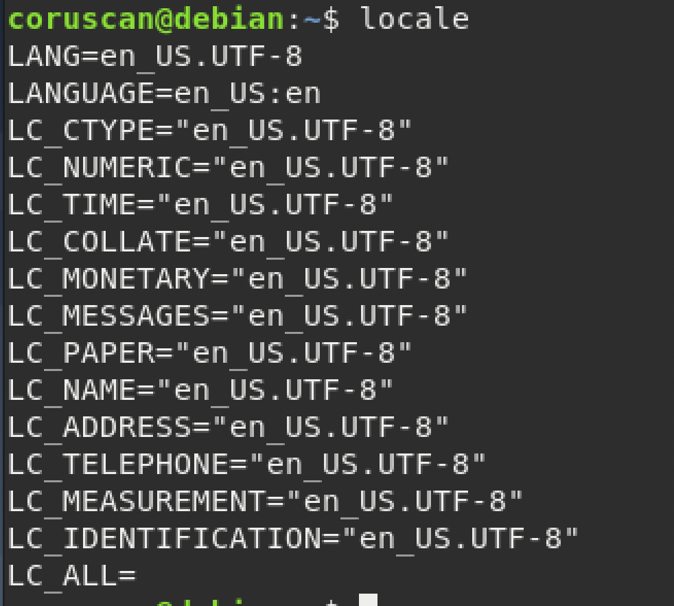

<h2>Чек-лист 1</h2>

**<h3>1.1 - Проверка на соответствие производительности ЦПУ, ОЗУ</h3>**

Командой ***htop*** проверили соответствует ли размер ОЗУ и количество потоков процессора рассчетным требованиям под ожидаемую нагрузку на сервер или сервера **Сore/Sensor**. Ожидаемая нагрузка определяется пропускной способностью сети. 

К примеру, односерверная конфигурация All-in-One, означающая установку модулей Core и Sensor на одном физическом сервере не способна захватить больше 1Гбит трафика в секунду. 

P.S Минимальные аппаратные требования описаны в пункте 9 руководства администратора.

**---------------------------------------------------**

**<h3>1.2 - Проверка поддержки сетевых карт</h3>**

Сенсор PT NAD использует один из трех механизмов захвата трафика — DPDK, AF_PACKET или PF_RING.

В зависимости от модели сетевой карты на физическом сервере мы подбираем механизм. 

Модель сетевой карты смотрим командой ***sudo lshw -c network | grep product***

**---------------------------------------------------**
**<h3>1.3 - Дисковая подсистема — созданы корректные разделы достаточного размера.</h3>**

Начнем с корневого раздела **/**. Он служит нам для расположения операционной системы, на нем мы распаковывали модули PT Nad. Так же при необходимости он служит оператору системы для выкачки PCAP-файлов, которые мы используем для изучения трафика, анализа работы сети, обнаружения хакерских атак. Рекомендуемый размер раздела - 200 Гб, в качестве устройства хранения корневого раздела допустимо использование жесткого диска.

Каталог **/es** используется для хранения обогащенной метаданными информации, данный раздел используется модулем Elasticsearch, расположенным в подсистеме хранения.  Его data node записывает метаданные на твердотельный(ssd) накопитель. Размер раздела определяется требуемой скоростью захвата трафика в секунду, а также сроком хранения информации.

Например, мой раздел /es на SSD односерверной конфигурации при скорости захвата 200Мбит/секунду позволит хранить информацию, обогащенную метаданными примерно 13 часов.

**0,0544Tb / (200 * 0,000486) * 24 hours = 13,4 hours**

Каталог **/pcaps** используется для хранения исходной 'сырой' копии трафика в виде разбитых по потокам захвата и датам, PCAPS файлов. Для хранения сырого трафика, подходят жесткие диски и SSD. 

Мой раздел /pcaps на SSD односерверной конфигурации распологается "all-in-one", и при скорости захвата 200Мбит/секунду позволит хранить Pcaps-файлы сырого трафика, полученные от сенсора, точно также примерно 13 часов.

Интересно, что в многосерверной конфигурации данный раздел диска устанавливается лишь на Sensor сервере/серверах. Кстати управление сенсор-сервером располагается на core-сервере, поэтому если потребуется расположить их друг от друга на большом расстоянии стоит подумать о нескольких All-in-One конфигурациях. Также хранилища данных PCAPS инкапсулированы для каждого из  SENSOR серверов.

**---------------------------------------------------**

**<h3>1.4 - Доступ к серверу обновлений — сервер https://update.ptsecurity.com доступен.</h3>**

Доступ к https://update.ptsecurity.com осуществляется через сервер nginx, который нужен для снижения нагрузки на основной сервер, т.к многопоточен в своей работе. 

 Конкретно эта команда позволяет проверить - доступен ли сайт с нашей физической машины? В многосерверной конфигурации проверять это необходимо с сервера Core. Делаем мы это для поддержки актуальности продукта и его лицензии.

 **---------------------------------------------------**

 **<h3>1.5 - Дистрибутив — распакован.</h3>**

 Дистрибутив я получил через dropmefiles.com. Пробовал использовать общую папку, однако ответы stackoverflow об ошибке несовместимости убили слишком много времени.
 Распаковывал утилитой tar.

 **---------------------------------------------------**

 **<h3>1.6 - Системное время — синхронизировано с сервером времени.</h3>**

timedatectl

 **---------------------------------------------------**

 **<h3>1.7 - Локализация — установлена локализация en_US.UTF-8.</h3>**

