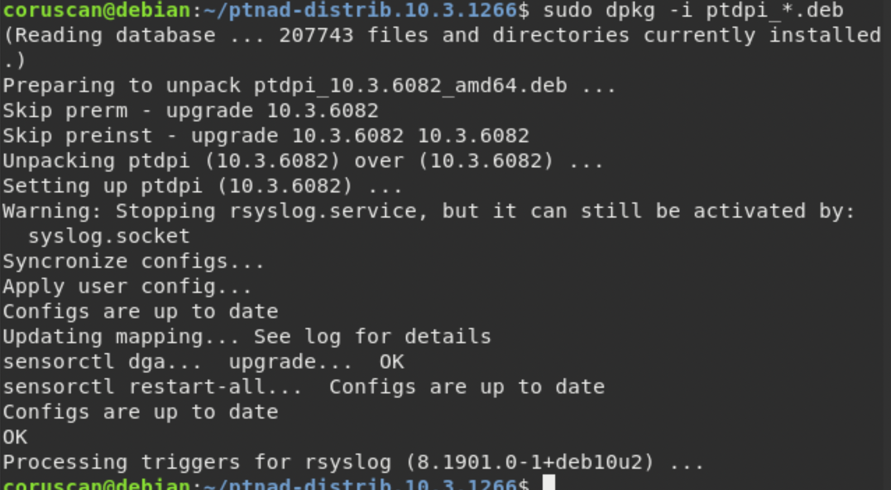
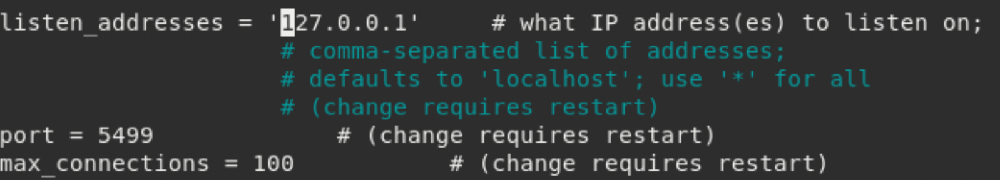

<h2>Чек-лист 2</h2>

**<h3>1.1 - Зависимости и пакет Elasticsearch — установлены.</h3>**

Перед установкой elasticsearch-модуля, необходимого для хранения метаданных, требуется установить зависимость openjdk-8-jre (JavaDevelopmentKit т.к Elasticsearch написан на джаве). 
apt-transport-https открывает доступ к получению, зашифрованных tls протоколом, пакетов https.

**---------------------------------------------------**

**<h3>1.2 - Права доступа к каталогу /es — выданы для пользователя и группы
elasticsearch:elasticsearch.</h3>**

Поменяли владельца и группу владельцев каталога, пользователь elasticsearch полностью контроллирует /es.

**---------------------------------------------------**
**<h3>1.3 - Ноды Elasticsearch — развернуты в варианте многосерверной конфигурации.</h3>**

Посмотрел открытые порты с 9200 по 9399.

Было 6 ядер и 12 потоков.
Оставил 4 потока на работу ОС,
по 2 на клиент-сервер ноды, 4 на дата-нод.

Из 12 гб оперативной памяти на ресурсы elasticsearch использовал 6.

**---------------------------------------------------**

**<h3>1.4 - Ноды Elasticsearch — отвечают на curl-запрос.</h3>**

Команда для проверки доступа к серверу Elasticsearch с указанием IP-адресa сервера.

 **---------------------------------------------------**

 **<h3>1.5 - Параметры блокировок — настроены для высоконагруженных систем.</h3>**

**memlock** отвечает за блокировку данных в оперативной памяти, value - число килобайт, после которого либо произойдет блокировка (hard), либо вылезет предпреждение (soft).

Ограничение ресурса **nofile** устанавливает ограничение на количество открытых файлов.

 **---------------------------------------------------**

 **<h3>1.6 - Планировщик ввода-вывода — настроен.</h3>**

Имя используемой дисковой подсистемы для каталога /es - sda6

Изначально у меня использовался **mq deadline** со значением **none**
Строка **modprobe cfq-iosched && echo cfq | tee /sys/block/sd*/queue/scheduler** в файле **/etc/rc.local**
предназначенным для запуска скриптов во время загрузки системы, позволила выбирать между тремя планировщиками ввода-вывода.

 **---------------------------------------------------**

 **<h3>1.7 - Пакет PostgreSQL — установлен.</h3>**

 
 **---------------------------------------------------**

 **<h3>1.8 - Пакеты Redis и nginx — установлены.</h3>**

 

**---------------------------------------------------**

 **<h3>Пакеты apport и irqbalance — удалены из ОС (при использовании Ubuntu 16.04).</h3>**

 

**---------------------------------------------------**

<h2>Чек-лист 3</h2>

**<h3>1. - Зависимости и пакет ptdpi — установлены.</h3>**

 

 **---------------------------------------------------**

 **<h3>2. - Зависимости и пакет ptnad в режиме Web Server— установлены.</h3>**

Пакет ptnad и зависимости уже были установлены в конфигурации All-in-One, повторный запуск не открыл окна меню выбора.

  **---------------------------------------------------**

   **<h3>3. Модули ptdpi-ad-worker, ptdpistat, ptnad-reporter и ptdecrypt — установлены.</h3>**

   
   

   Каждый модуль ptdpi-worker получает и передает в модуль ptdpi-broker определенные типы файлов от ptdpibroker модуля системы обогащения, что позволяет регулировать нагрузку на модули.

   ptdpi-ad-worker используется для анализа сквозного сырого трафика **сети**.

   ptdpistat для передачи статистики в систему мониторинга с узлов, где установлена часть сенсора ptdpi.

   ptnad-reporter для генерации отчетов, на основе данных с nad-web-server.

   ptdecrypt (password decrypt) используется для дешифровки всех передаваемых данных.

  **---------------------------------------------------**

  **<h3>4. Параметр listen_addresses в конфигурации PosgreSQL — указан адрес сервера.</h3>**

 
