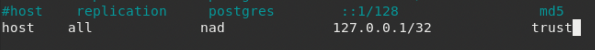
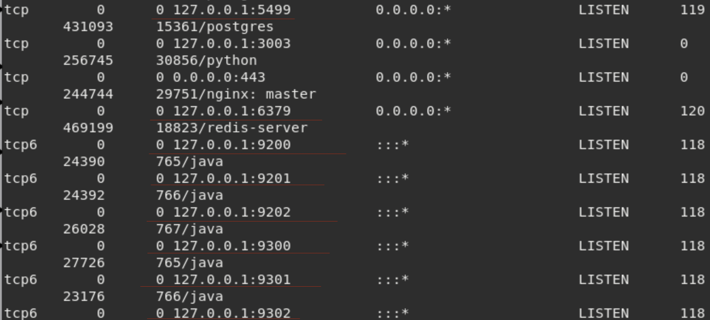
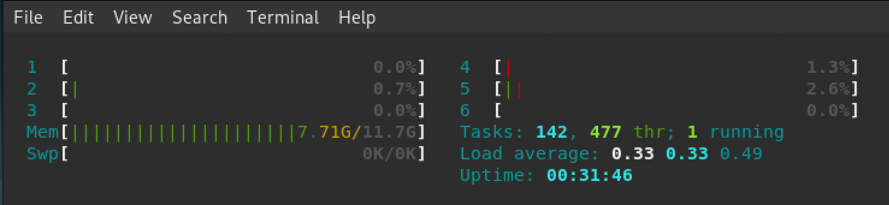
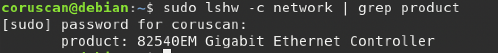
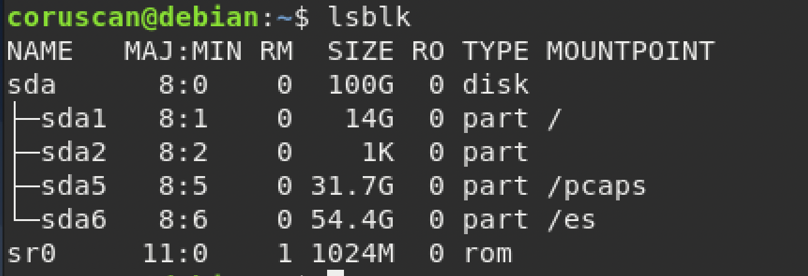
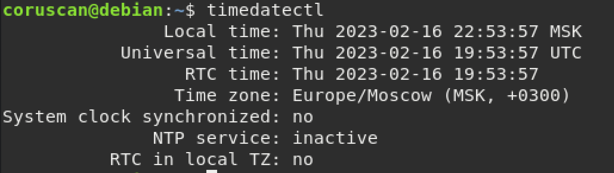
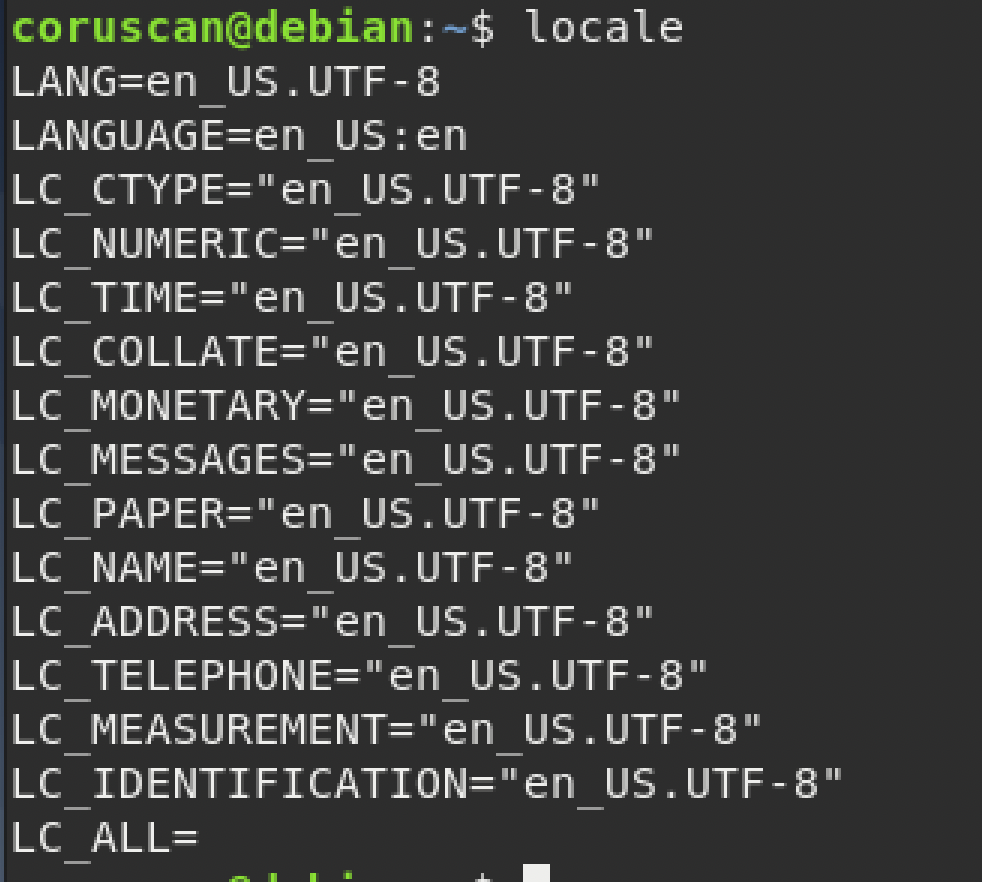

<h2>Чек-лист 2</h2>

**<h3>1.1 - Зависимости и пакет Elasticsearch — установлены.</h3>**

Перед установкой elasticsearch-модуля, необходимого для хранения метаданных, требуется установить зависимость openjdk-8-jre (JavaDevelopmentKit т.к Elasticsearch написан на джаве). 
apt-transport-https открывает доступ к получению, зашифрованных tls протоколом, пакетов https.

**---------------------------------------------------**

**<h3>1.2 - Права доступа к каталогу /es — выданы для пользователя и группы
elasticsearch:elasticsearch.</h3>**

Поменяли владельца и группу владельцев каталога, пользователь elasticsearch полностью контроллирует /es.

**---------------------------------------------------**
**<h3>1.3 - Ноды Elasticsearch — развернуты в варианте многосерверной конфигурации.</h3>**

Посмотрел открытые порты с 9200 по 9399.

Было 6 ядер и 12 потоков.
Оставил 4 потока на работу ОС,
по 2 на клиент-сервер ноды, 4 на дата-нод.

Из 12 гб оперативной памяти на ресурсы elasticsearch использовал 6.

**---------------------------------------------------**

**<h3>1.4 - Ноды Elasticsearch — отвечают на curl-запрос.</h3>**

Команда для проверки доступа к серверу Elasticsearch с указанием IP-адресa сервера.

 **---------------------------------------------------**

 **<h3>1.5 - Параметры блокировок — настроены для высоконагруженных систем.</h3>**

**memlock** отвечает за блокировку данных в оперативной памяти, value - число килобайт, после которого либо произойдет блокировка (hard), либо вылезет предпреждение (soft).

Ограничение ресурса **nofile** устанавливает ограничение на количество открытых файлов.

 **---------------------------------------------------**

 **<h3>1.6 - Планировщик ввода-вывода — настроен.</h3>**

Имя используемой дисковой подсистемы для каталога /es - sda6

Изначально у меня использовался **mq deadline** со значением **none**
Строка **modprobe cfq-iosched && echo cfq | tee /sys/block/sd*/queue/scheduler** в файле **/etc/rc.local**
предназначенным для запуска скриптов во время загрузки системы, позволила выбирать между тремя планировщиками ввода-вывода.

 **---------------------------------------------------**

 **<h3>1.7 - Пакет PostgreSQL — установлен.</h3>**

 
 **---------------------------------------------------**

 **<h3>1.8 - Пакеты Redis и nginx — установлены.</h3>**

 

**---------------------------------------------------**

 **<h3>Пакеты apport и irqbalance — удалены из ОС (при использовании Ubuntu 16.04).</h3>**

 

**---------------------------------------------------**

<h2>Чек-лист 3</h2>

**<h3>1. - Зависимости и пакет ptdpi — установлены.</h3>**

 

 **---------------------------------------------------**

 **<h3>2. - Зависимости и пакет ptnad в режиме Web Server— установлены.</h3>**

Пакет ptnad и зависимости уже были установлены в конфигурации All-in-One, повторный запуск не открыл окна меню выбора.

  **---------------------------------------------------**

   **<h3>3. Модули ptdpi-ad-worker, ptdpistat, ptnad-reporter и ptdecrypt — установлены.</h3>**

   
   

   Каждый модуль ptdpi-worker получает и передает в модуль ptdpi-broker определенные типы файлов от ptdpibroker модуля системы обогащения, что позволяет регулировать нагрузку на модули.

   ptdpi-ad-worker используется для анализа сквозного сырого трафика **сети**.

   ptdpistat для передачи статистики в систему мониторинга с узлов, где установлена часть сенсора ptdpi.

   ptnad-reporter для генерации отчетов, на основе данных с nad-web-server.

   ptdecrypt (password decrypt) используется для дешифровки всех передаваемых данных.

  **---------------------------------------------------**

  **<h3>4. Параметр listen_addresses в конфигурации PosgreSQL — указан адрес сервера.</h3>**

 
 Для передачи данных c Sensor на сервер удаленной базы данных POSTGRESQL на Core по-умолчанию используется порт 5499.
 Настройка в **/etc/postgresql/9.5/nad/postgresql.conf**

  **---------------------------------------------------**

  **<h3>5. Адреса серверов Core и Sensor в файле pg_hba.conf — указаны.</h3>**

 
  Этот файл контролирует аутентификацию к СУБД Postgresql, мы внесли разрешение на подключение с нашего хоста.

  **---------------------------------------------------**

  **<h3>6. Параметр bind в конфигурации Redis — указан адрес сервера.</h3>**

Redis используется для хранения кеша.
  

    Redis обосновался в компактной нише в качестве временного кэша для данных которыми вы можете пожертвовать, но не главного хранилища данных. Он используется для обеспечения наилучшей производительности, но не может гарантировать высокую надежность хранения.

**---------------------------------------------------**

**<h3>7. Отображаются запущенные сервисы PosgreSQL, Redis,
Elasticsearch, прослушивающие сеть на адресе сервера, с верными портами TCP.</h3>**

 

**---------------------------------------------------**

 <h2>Чек-лист 4</h2>

 **<h3>1. В файле ptdpi.settings.yaml — указаны параметры elastic_host, broker_host,
workers; настроены параметры Elasticsearch.</h3>**

 

Указали в строке workers обработчики трафика, адрес broker_host служит мостом между проанализированным трафиком ptdpi и модулями обогащений ptdpi-worker.

 

 Размер одного фрагмента не может превышать 50 гб, размер /es превышает. Также, при моей скорости в сутки записывается 100 гб трафика, поэтому я указал 2 фрагмента es_online_shards.

 **---------------------------------------------------**

 **<h3>2. Сервис ptdpictl — остановлен (только на сервере Core!).</h3>**

 Останавливать сервис я не могу, тк конфигурировал all-in-one.

 Список моих работающих процессов workers сопоставлен с ptdpi.settings.yaml:
 

 **---------------------------------------------------**

 **<h3>3. В файле nad.settings.yaml — указаны параметры server_url, redis_uri, database_uri
и elastic_uri; установлен режим работы webworker.</h3>**

 

 
В файле настройки веб-сервера мы указали данные, которые сможет использовать сервер Sensor для обновления, доступа к базам данных, доступа к клиентской ноде.

Nad-task-server — это сервер приложений, который используется для обработки порожденных запросов модулем PTDPI и веб-сервером.

 **---------------------------------------------------**

 **<h3>4. Сервисы nad-web-server и nad-task-server — перезапущены.</h3>**

  

 **---------------------------------------------------**

 <h2>Чек-лист 5</h2>
Количество потоков и ОЗУ

Сетевая карта (При скорости свыше 1гб/сек должна быть из списка доступных - **Руководство по внедрению 39стр.**)

Раздел /pcaps для хранения сырого трафика составляет 31.7гб на SSD, его хватит на 7-8 часов.

Системное время на сервере синхронизировано

Установлена локализация en_US.UTF-8.

 **---------------------------------------------------**

 <h2>Чек-лист 6</h2>

Пакет nginx установлен

Пакеты apport и irqbalance — удалены из ОС (при использовании Ubuntu 16.04).

Зависимости и пакет ptdpi — установлены.

Зависимости и пакет ptnad в режиме NAD Sensor — установлены.
Пакет ptnad и зависимости уже были установлены в конфигурации All-in-One, повторная установка не открыла окно меню выбора.

Модули ptdpi-icap-worker и ptdpistat — установлены.

 **---------------------------------------------------**

  <h2>Чек-лист 7</h2>

  **<h3>1. В файле ptdpi.settings.yaml — указаны параметры broker_host с адресом сервера
Core; broker_type указан как remote.</h3>**

В случае, отличающимся от конфигурации All-in-One, на сервере Sensor необходимо было задать закоментированные настройки скриншота выше. 

**broker_type: remote** показывает удаленность сервера Sensor, хотя физически они могут быть развернуты в соседних ячейках.

 **---------------------------------------------------**

**<h3>2. Параметр pcap_path в файле ptdpi.settings.yaml — указывает на верный каталог для
записи "сырых" данных.</h3>**

 **---------------------------------------------------**

**<h3>3. В файле nad.settings.yaml — указаны параметры server_url, redis_uri и
database_uri; установлен режим работы sensor.</h3>**

**running mode в настройке Nad:**

    standalone - все в одном
    sensor - сервер-сенсор
    webworker - веб-сервер (Core)

 **---------------------------------------------------**

**<h3>4. Сервис nad-web-server — отключен и остановлен.</h3>**

Делать это нужно в многосерверной конфигурации на Sensor сервере.

**---------------------------------------------------**

**<h3>5. Сервис nad-task-server — указан как запускаемый автоматически.</h3>**

P.S Можно использовать rc.local для этих целей.

**Команда: sudo systemctl enable nad-task-server**

**---------------------------------------------------**

**<h3>6.1 Сервисы ptdpictl, ptdpistat и nad-task-server — перезапущены.</h3>**
**<h3>6.2 Сервер nfs-kernel-server — установлен и настроен на сервере Sensor.</h3>**
**<h3>6.3 Сервер nfs-kernel-server — установлен и настроен на сервере Core, успешно подключен.</h3>**

    При подключении нескольких серверов Sensor потребуется их разделение на стороне сервера Core,
    поэтому нужно в каталоге /pcaps создавать директории для каждого из хранилищ Sensor.

Показал через менеджер пакетов, что nfs-kernel-server установлен.

Файл /etc/exports используется для конфигурации NFS сервера

Установливаем и монтируем в /etc/fstab на сервере Core директорию /pcaps с Sensor сервера
используя протокол сетевого доступа к файловым системам NFS.
